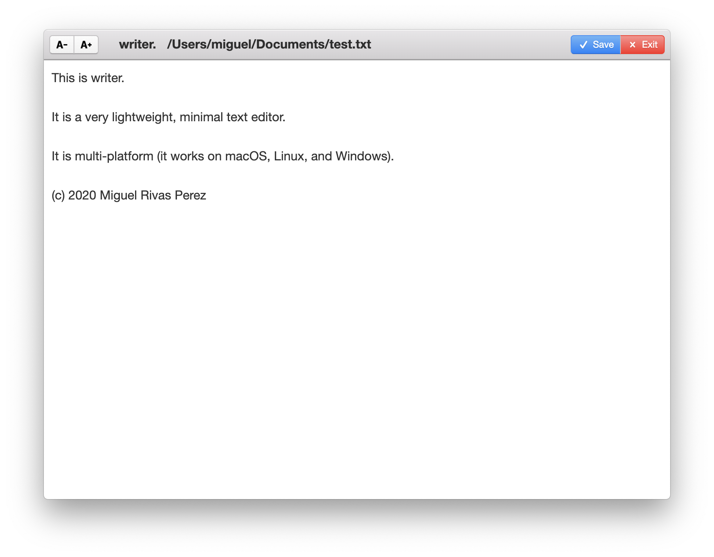

Writer is a lightweight, multi-platform, text editor. It's great for taking notes, writing a letter, or writing a whole book with minimal distractions and confusing options. I built it using the Electron JS framework.

## Getting Started

### Prerequisites

You will need the following software installed on your system before you are able to follow these instructions to run or package and run this application.

-[Git](https://git-scm.com/) -[nodeJS](https://nodejs.org/)

### Installing

You can copy and pase the following commands into macOS, Linux, or Windows Terminal.

1. Clone this repository locally:

```
git clone https://github.com/mrivasperez/writer..git
```

2. Install dependencies with npm:

```
npm install
```

3. Run for production (with packaging or installing the application)

```
npm start
```

4. Package for installation (Install the application on your system to run it as an application instead of relying on Terminal interfaces)

```
macOS:
npm run package-mac

Windows:
npm run package-win

Linux:
npm run package-linux
```

## Acknowledgements

- Photon UI Kit
- Icons 8
- [Mubarak Awal](https://awal.dev/) for the inspiration and knowledge <3
